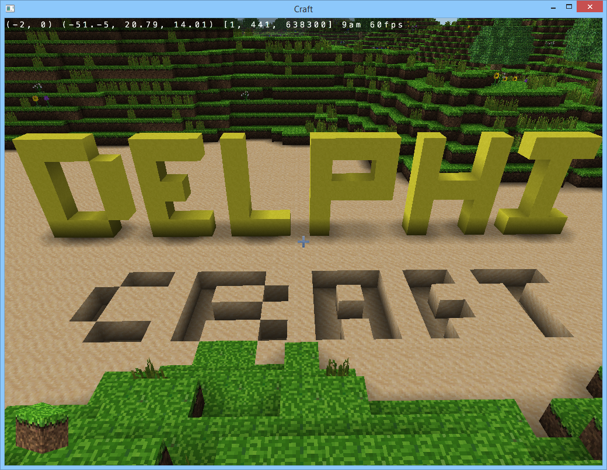

# Delphi Craft

this is a Delphi translation of the C project by Michael Fogleman
 
 https://www.michaelfogleman.com/projects/craft/
 
 
 
the code is somehow inhabituel for a Delphi developer because it's a raw translation of the original code with as few change as possible to identify easily the translation errors.

it took me some time to identify two errors:
 1. shr in Delphi is not signed, >> in C is signed.
 3. C do not have a div operator, I've miss translated a / to a float operator.